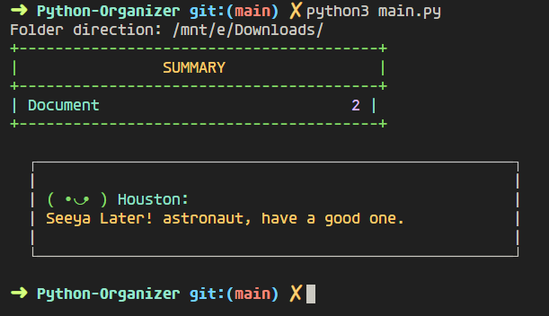
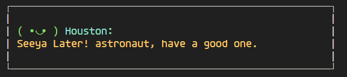

# 🗂️ File Organizer Script

 


Un script de Python diseñado para organizar archivos en una carpeta según sus extensiones. Los archivos se mueven automáticamente a carpetas basadas en su tipo (imágenes, videos, documentos, etc.), creando las carpetas si no existen. Si no se encuentra una categoría para un archivo, se coloca en una carpeta "Otros". Utiliza la biblioteca `colorama` para mejorar la visualización en la terminal y muestra un resumen de los archivos organizados.

## 🚀 Características

- 📂 **Organización automática**: Archivos movidos a carpetas según su formato.
- 📁 **Creación dinámica de carpetas**: Si no existen, se crean automáticamente.
- 📊 **Resumen detallado**: Al finalizar, se muestra un resumen con la cantidad de archivos organizados por categoría.
- 🎨 **Visualización mejorada**: Uso de colores en la terminal para una mejor experiencia visual.

## 📦 Instalación

1. Clona este repositorio en tu máquina local:
   ```bash
   git clone https://github.com/Helien-Dev/Python-Organizer.git
   ```

2. Navega a la carpeta del proyecto:
   ```bash
   cd python-organizer
   ```

3. Instala las dependencias necesarias:
   ```bash
   pip install -r requirements.txt
   ```

## 🛠️ Uso

1. Ejecuta el script:
   ```bash
   python organizer.py
   ```

2. Cuando te lo solicite, ingresa la ubicación de la carpeta que deseas organizar.

## 📋 Ejemplo de Uso

```bash
Folder direction: /ruta/a/tu/carpeta
```

El script organizará los archivos en subcarpetas como `Imágenes`, `Videos`, `Documentos`, etc. Si un archivo no coincide con ninguna categoría, será movido a la carpeta `Otros`.

## 📷 Capturas de Pantalla

| Resumen de Archivos Organizados | Mensaje de Despedida |
| :-----------------------------: | :------------------: |
|  |  |

## 🤖 Tecnologías Utilizadas

- **Python 3.12**
- **Colorama**: Para mejorar la visualización en terminal.
- **Shutil & Pathlib**: Para la manipulación de archivos.

## 📝 Licencia

Este proyecto está bajo la licencia MIT. Consulta el archivo [LICENSE](LICENSE) para obtener más información.

---

_Hecho con ❤️ por [Alvaro Avila Dev](https://github.com/Helien-Dev)._
